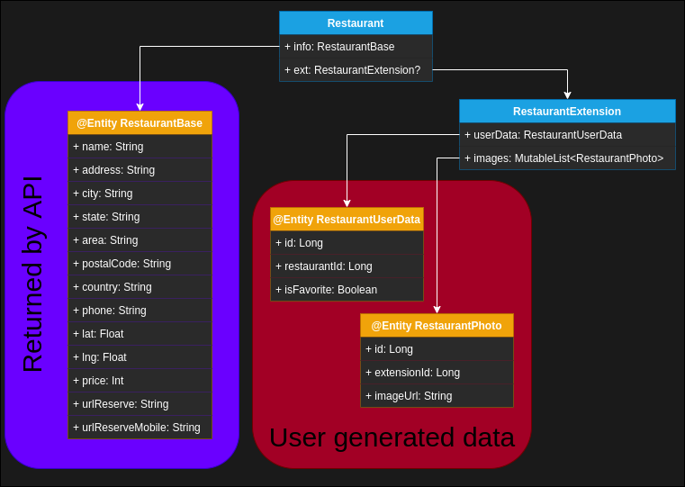

# Sapientia-Android2020-Project: Where to eat?

During Android courses we had to do a little app as a project, where we  can explore restaurants and expand the data we have from the REST API with our experience. The goal was to have an app which works well, where the user can have a profile,  get data from the API as mentioned, list it, view it one by one, and store the modifications in a local database.

## 1. Requirements

The design and UX was on us, we just had to make sure, that it is simple, shiny and usable, and use Android basic design components and colours.

### 1.1. Screens which need to be present in tha app

1. Splash(Loading/Start) Screen
2. Main Screen - with the restaurant’s list, paginated
3. Detail Screen - each restaurant has its own page, that can be accessed  from the list item, when you tap it
4. Profile Screen

### 1.2 Mandatory components

1. Activity (max two)
2. Fragments
3. Recycler View
4. Room and/or SQLite
5. Constraint Layout
6. Retrofit
7. Glide

### 1.3. Spalsh screen

Here the loading is happening, the data is initialised, and  when user gets from here to the Main Screen, the data is already loaded.

### 1.4. Main creen

Here is the main list with the restaurants, paginated (loaded in smaller chuncks). The user is able to do text search or filtering by:
    • City list,
    • Price options.
Each item has to have: Title, Address, Image,  Price, Favourite icon (with this you can favourites it in/out).

### 1.5. Detail screen

On the detail page the user can view all the information returned by the API and edit it according to  the possibilities.
These possibilities are: Favourites, Add/Delete Images. Other things: open  Google Maps with the coordinates of the restaurant, call the place.
Regarding displaying the images, if you have added your own  ones, then they are prioritised and those should be displayed instead of the ones from the API. In the case when you have not added images by your own, then display BE image or if not exists then a  placeholder.

### 1.6. Profile screen

Here you can manage your own profile, what has to contain:

- Name
- Profile pic
- Address
- Phone number
- Email
- List of Favouritesed restaurants.

## 2. Development

Unfortunetly, during the development, the Original API chrased for unknown reasons and became unusable. For this reason another api was created with the same functionality (you can find out more at the [API's GitHub page](https://github.com/hammasattila/Sapientia-Android2020-RestAPI)). This API was hosted [here](https://ratpark-api.imok.space/).

### 2.1. Navigation

The navigation was made using the [JetPack's Navigation Component](https://developer.android.com/guide/navigation).

The data betwean fragments was exchanged using [JetPack's Safe Args Library](https://developer.android.com/guide/navigation/navigation-pass-data)

### 2.2. API & Persistency

The REST API's data was accessed using [RETROFIT](https://square.github.io/retrofit/) http client. The data in the response was cached using [ROOM DATABASE](https://developer.android.com/training/data-storage/room).

The classes marked with **@Entity** represent a database schema. As you can se the data returned from the API is stored separatly from the user generated data. But when displayed to the user is joined (and agregated) to represent a complet (Restaurant) data.

During development the REST API was hosted at [https://ratpark-api.imok.space/](https://ratpark-api.imok.space/). The server, subdomain and HTTPS certificate was provided by [IMOK](https://imok.biz/).

### 2.3. Design

| Sreen | Description | Screenshot |
| ----------- | ----------- | ----------- |
| Splash Screen | A simple map loading animation. |  |
| Main Screen | A list of restaurants aranged in a 2 column grid. |  |
| Filter Screen | A list of edit texts and spiners for filtering parameters |  |
| Detail Screen | A list of textviews showing the data from the API. At the bottom an array of buttons for aditional functionality like calling, opening maps, etc. An image view at the top for displaying the featured image. |  |
| Profile Screen | Greeting text at the top of tha screen, followed by a simple form for the profile details with a save button. At the bottom of the page is a list with the favorite restaurants. |  |
| App Information Screen | Contains 2 CardViews in which are few lines about the application and the API. |  |

## 3. Conclusion

During the cours I lerned few of the fundamental ideas of android development. The project is far from perfect there are some bugs here and there, but it works.
